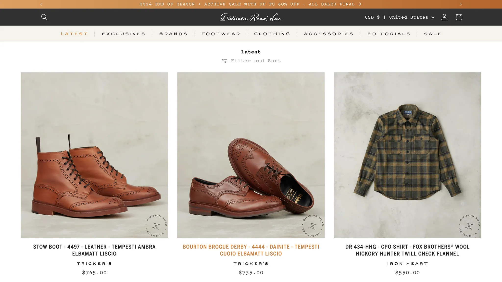

# Legacy Theme Migration

## Overview

Division Road, Inc. is a luxury heritage menswear boutique who needed to replace their depreciated Shopify theme. Their storefront is central to their brand and operations which demanded a seamless transition.

Beyond massive improvements to both speed and experience, we added a heavy dose of bespoke functionality, making it easier for their team to customize their site.

## Challenges

- Their customer does not like change – we had to ensure that the new theme was a drop-in replacement for the old theme. 
- Beyond security updates,2015 to 2024 saw a lot of changes in Shopify – we had to identify all depreciated features, seamlessly replace them, and ensure that the new theme was backwards compatible.
- Identifying any content requiered in multiple locations on the site and utilizing metafields and metaobjects to ensure that the content was consistent across the site.

## Custom Features

- VirtuSize apparel measurementapp replacement with custom modal pop-up to display app's measurements + custom metaobjects sizing content.
- Event calendar built using metaobjects
- Footwear and apparel sizing guides built using metaobjects – Products pages pull in related sizing content from the metaobjects.
- Custom Buy X Get Y cart and cart-drawer section to display promotional items and discounts based on the customer's cart.
- Custom appointment booking app integration.
- Custom worn-with section to display products that are worn with the product.
- Custom related blog posts to display related blog posts on the product page.

## Results

The new theme is a drop-in replacement for the old theme. It is faster and more responsive. It is also more customizable.

- Lighthouse score of 95 up from 35
- Visual stability up 96%
- Loading speed up 37%
- Search conversion rate up 189%
- Online visitors up 69%
- Sessions up 23%
- Bounce rate down 18%